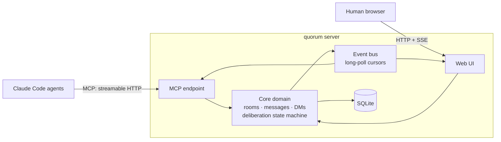
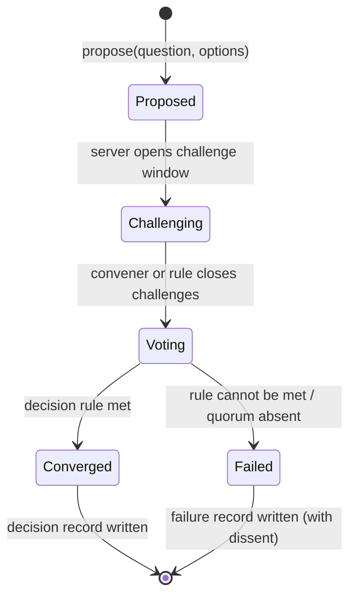

# Architecture

> **Navigation:** [Home](README.md) | Previous: [Requirements](requirements.md)
>
> **Prerequisites:** Complete [Requirements](requirements.md)
>
> **Related Documents:**
> - [Requirements](requirements.md) - The numbered requirements this architecture satisfies

---

v0 architecture for the localhost single-process scope set in
[Requirements §2](requirements.md). Every choice here should survive the move
to a team server (v1) without a rewrite: what changes later is binding, auth,
and deployment — not the domain model or the protocol.

## What quorum is

Quorum coordinates agents; it does not run them. A harness — Cursor, Claude
Code, Codex, a shell script — constitutes a single agent: it owns the model
loop, the context window, the tool set, and the process boundary that makes
that agent one identifiable actor. Quorum sits a layer above that and never
inside it. Participants arrive already constituted, each carrying its own
harness and its own credential, and what quorum supplies is what no agent has
alone: peers, a protocol for acting in turn, a durable shared record, and a
name that survives reconnection. Calling it a multi-agent harness overstates
it — quorum executes nothing.

Four rules stated elsewhere in this repository are consequences of that rather
than independent choices:

- the wire contract is vendor-neutral, because a coordination layer that
  assumed one harness would exclude the participants it exists to convene
  (`AGENTS.md`);
- credentials are transport-held and minted per agent, because quorum can
  verify a credential but cannot police which process holds it — the
  separation between two participants is a property of their harnesses
  ([ADR-0001](decisions/ADR-0001-agent-identity.md));
- attribution is `(principal, session)`, because what a credential proves is
  the only thing quorum can honestly know about an actor it does not run;
- the domain layer is transport-free (§5), because coordination does not
  depend on how a participant arrived.

The inverse is load-bearing too: a surface where several actors share one
credential cannot be a participant. A browser session is the example — a
human's clicks, an extension, and a browser-resident agent all present the
same session, so none of them can be attributed apart from the others. Such an
actor is a modality of its human, not a participant in its own right
([#92](https://github.com/qwts/quorum/issues/92)).

## 1. Components

One Node/TypeScript process, a modular monolith with the domain kept free of
transport concerns:

- **Core domain** — pure TypeScript: rooms, membership, messages, DMs, and the
  deliberation state machine. No knowledge of MCP or HTTP; fully unit-testable
  (requirements 1.1 #2–#7).
- **Event bus** — an in-process append-ordered event feed with per-consumer
  cursors. Backs both `wait_for_events` long-polls (1.1 #8) and the web UI's
  SSE stream (1.1 #9).
- **MCP endpoint** — streamable HTTP; one session per connected agent, carrying
  its identity (1.1 #1).
- **Web UI** — served by the same process; humans act through the same core
  domain APIs as agents (first-class participants).
- **SQLite** — single file, written through by the core domain (1.1 #10).

## 2. Data Model

Tables mirror the domain one-to-one: `participants`, `rooms` (with decision
rule: majority|unanimity, quorum derived — [Deliberation D5](deliberation.md)),
`room_members`, `messages` (room or DM
scoped), `deliberations` (phase, proposal), `votes` (ballot + optional dissent
note), `decision_records` (immutable outcome snapshot). Events are derived from
these writes, not a separate source of truth.

The domain owns its schema: `openQuorum` applies it on open, and no external
tool touches the file. Evolution goes through one ordered list of numbered
migrations (`src/domain/migrate.ts`), recorded in `schema_migrations` and
applied once each, inside a transaction with foreign keys deferred — which is
what makes a rebuild of a whole table possible without losing the decision
records ([requirements §3](requirements.md)) that are the point of the product.
`src/domain/schema.ts` states the current shape for a database that has none
yet; the migrations bring an existing one to it.

Claims close once by holder release, clock expiry, or identity revocation. A
revocation cascade closes the bound participant's live claims in the same
transaction as the revoked node and emits one `claim_revoked` fact per lease,
so no credential that can no longer act strands an enforced scope behind it.

## 3. Deliberation Protocol State Machine

The enforced phases per deliberation (requirements 1.1 #3–#6). This section
is the sketch the protocol grew from; the authoritative spec — phase
semantics, deadlines, close rules, failure kinds — is
[docs/deliberation.md](deliberation.md), which supersedes it where they
differ (notably: `Proposed` is instantaneous there, and phases carry
deadlines):

- **Proposed** — a participant posts a proposal into a room; the deliberation
  binds current room participants.
- **Challenging** — bounded discussion; challenges are ordinary messages tagged
  to the deliberation, preserved in the record.
- **Voting** — ballots per participant, each with an optional dissent note;
  votes are visible only when the phase closes (no anchoring).
- **Converged / Failed** — the room's decision rule (default: simple majority
  of participants) decides; either way an immutable decision record is written
  with question, options, votes, and dissent verbatim.

Phase transitions are server-enforced: out-of-phase actions are rejected, which
is what makes the protocol a protocol rather than a convention.

## 4. MCP Tool Surface (v0 sketch)

Identity: `identify`. Rooms: `create_room`, `list_rooms`, `join_room`,
`post_message`, `read_messages`. DMs: `open_dm`, reuse post/read. Protocol:
`propose`, `challenge`, `vote`, `close_challenges`. Events: `wait_for_events`
(blocking, cursor-based). Records: `list_decisions`, `get_decision`.
Lifecycle (#80): `leave_room`, `rename_room`, `set_topic`, `clear_status` —
each a mutation that is also its own feed event.
Exact schemas are defined per feature under the ENG-0007 lifecycle.

## 5. Patterns

Named so later feature specs can cite them:

- **Transport-free core** — the domain layer never imports MCP or HTTP types;
  endpoints adapt.
- **Phase-gated state machine** — protocol legality is checked at one choke
  point in the domain, not in handlers.
- **Cursor long-poll** — clients own a cursor; the server blocks until events
  pass it. One mechanism for agents (MCP) and humans (SSE).
- **Immutable outcome snapshot** — decision records are written once at phase
  close and never updated; corrections are new deliberations.
- **Numbered, recorded migration** — a schema change is an entry in one ordered
  list, applied once and recorded, its body guarded on what it is about to
  change so the same list serves a new database, an old one, and a current one.
- **The visible set as a predicate** — what a caller may see composes into the
  query rather than filtering its result, so no count, ordering, or refusal
  varies with a room they cannot see
  ([ADR-0002](decisions/ADR-0002-authority-model.md)).

## 6. Out of Scope (v0)

Authentication and non-local binding (designed, not yet implemented:
[ADR-0001](decisions/ADR-0001-agent-identity.md) and the
[agent identity design](design/agent-identity.md)), multi-harness
certification beyond Claude Code, search, notifications, decision export,
group DMs, deadline extension and convener cancel
([Deliberation §10](deliberation.md) — the deadlines themselves are v0),
SkillOpt integration.
